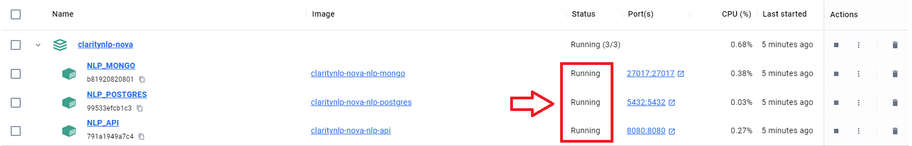
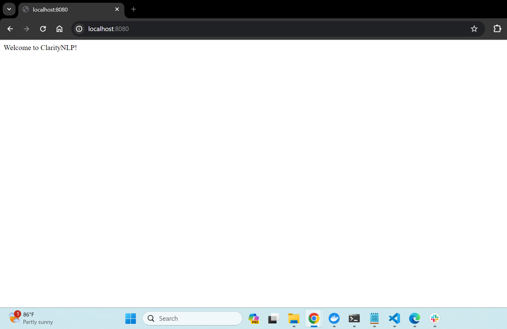

# Local Machine Setup With Docker
The instructions below will get you up and running with a Docker-based ClarityNLP-Nova instance on your laptop or desktop. We will walk you through how to configure and deploy a couple of Docker containers comprising a complete ClarityNLP-Nova installation for a single user. There is no need for you to separately install Solr, MongoDB, PostgreSQL, or any of the other dependencies that ClarityNLP-Nova uses. 

## Prerequisites 
### Download Source Code 
    git clone https://github.com/ClarityNLP/claritynlp-nova/tree/main
    cd claritynlp-nova

### Install Docker 
Follow these <a href="https://docs.docker.com/get-docker/#supported-platforms" target="_blank"> installation instructions.</a>

Memory: >8GB Disk: >256GB recommended, but can run on much less (depends on data needs)

These are the recommended Docker settings for ClarityNLP-Nova. In Docker, they can be updated via Docker > Preferences > Advanced.

## Bring Up the Services 
It will take a couple of minutes to build and run the images.  
Open a terminal and run the following:

    docker-compose -f docker-compose.localhost.yml pull && docker-compose -f docker-compose.localhost.yml up -d --build

To stop the services, run this command: 

    docker-compose -f docker-compose.localhost.yml down --remove-orphans

## Tips for Using Docker
To verify that the Docker containers are running, open a terminal and run: 

    docker ps 
    
You should see a display in your terminal like this:

    CONTAINER ID   IMAGE                          COMMAND                  CREATED          STATUS          PORTS                      NAMES
    f69fc0edd2af   claritynlp-nova-nlp-postgres   "docker-entrypoint.s…"   36 minutes ago   Up 36 minutes   0.0.0.0:5432->5432/tcp     NLP_POSTGRES
    fb400f7ae713   claritynlp-nova-nlp-api        "tini -- gunicorn ap…"   4 hours ago      Up 36 minutes   0.0.0.0:8080->8080/tcp     NLP_API
    c116f4f1f081   claritynlp-nova-nlp-mongo      "docker-entrypoint.s…"   4 hours ago      Up 36 minutes   0.0.0.0:27017->27017/tcp   NLP_MONGO

If issues arise in your deployment, check the **Status** of your container and examine the logs. Make sure all containers are **Running**. 

## Dashboard  
Go to a web browser and enter http://localhost:8080/

# Local Machine Setup Without Docker
Basic version of ClarityNLP that runs without Docker.

# Setup and Installation

    conda create --name claritynlp
    conda activate claritynlp
    conda config --env --add channels conda-forge
    conda config --env --set channel_priority strict

    xcode-select --install

    brew tap mongodb/brew
    brew install mongodb-community

Start mongo with this command:

    mongod --config /usr/local/etc/mongod.conf

Open a new mongo shell with this command:

    mongosh

Can shutdown the server with either:

    <CTRL>-C in the mongod terminal shell
or, from `mongosh`:

     db.adminCommand({shutdown:1})

Then cd to the `native_setup` folder and run:

    conda install --file conda_requirements.txt
    pip install -r conda_pip_requirements.txt

Install a Spacy pretrained model file:

    python -m spacy download en_core_web_sm

Install a few other model files:

    cd claritynlp-nova/nlp
    python install_models.py

Do the setup steps for Postgres and Solr on this page:
https://claritynlp.readthedocs.io/en/latest/setup/local-no-docker.html

Then follow the instructions in the `Running Locally without Docker` test on that page.